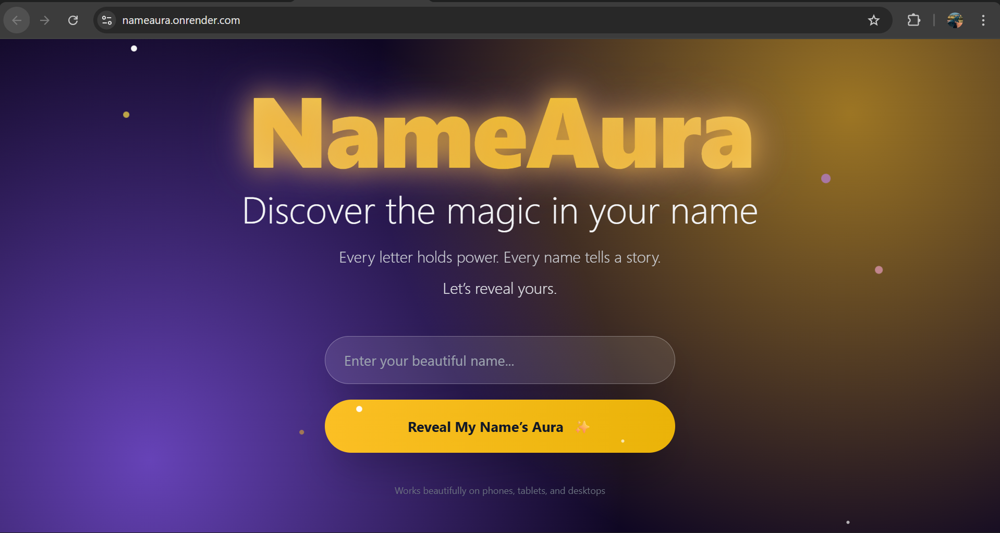
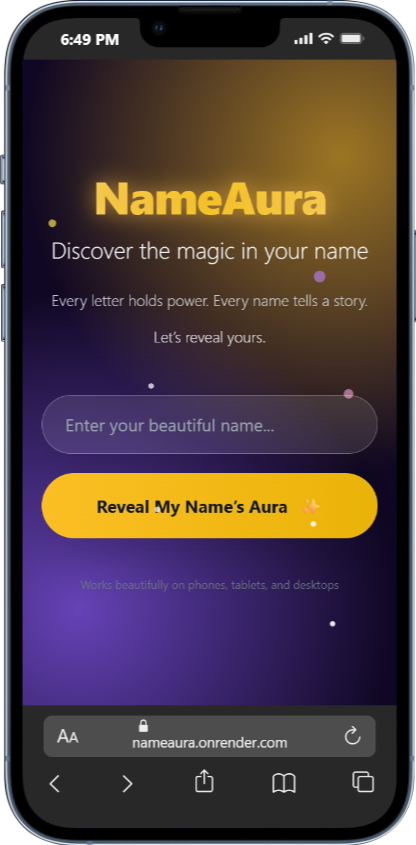
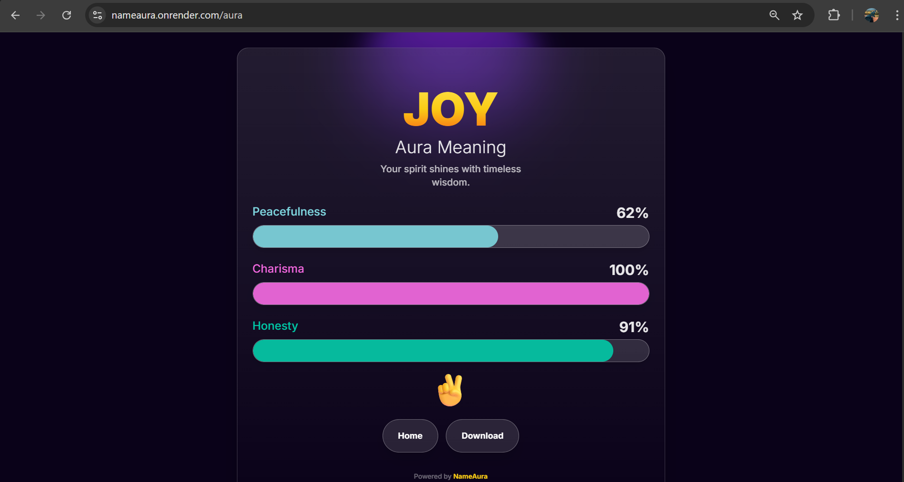

## NAMEAURA

NameAura is the capstone project from our six-week Python bootcamp. The student paired together to build the app from scratch: design explorers shaped the look and feel, while backend builders focused on routing and data flow. Weekly code retros helped us merge ideas, resolve conflicts in Git, and set the next sprint’s goals. By week six, we had deployed the software on Render and the bootcamp joyfully camp to an end.

### How the App Works
1. **Home form** – Users type a name on the Tailwind-powered landing page. The form POSTs to `/aura` without JS fetches, keeping accessibility high.
2. **Flask controller** – `app.py` receives the name, caps it, randomly selects three trait meanings, and passes everything into the template context. A session snapshot stores the result for the download feature.
3. **Templated UI** – `aura.html` renders the vibrant card (gradient typography, animated bars) and injects the trait scores and aura message. A light sprinkle of JavaScript (html2canvas + Web Share API) enables one-click downloads and sharing, hiding action buttons during capture for a clean export.
4. **Static assets** – Tailwind CDN, Animate.css, and our custom favicon live under `src/static/`. Flask serves them automatically because we set `static_folder='src/static'`.
5. **Deployment path** – The app runs locally with `python app.py` and scales on Render using `gunicorn app:app`. Environment variables (like `SECRET_KEY`) stay outside the repo via `.env`.

### Behind the Scenes
- **Trait engine** – Instead of storing fixed scores, we generate them on each request so every card feels personal. The color palette (aura_colors) keeps the chart cohesive.
- **Sessions** – Flask’s session stores the latest result, letting the download tool reuse data without regenerating the aura mid-export.
- **Accessibility & performance** – We added reduced-motion support, responsive font clamping, and ARIA labels on buttons so the experience works across devices and abilities.
- **Testing the polish** – Each Friday we held “break-the-app” sessions: testers tried emoji names, empty submissions, mobile share dialogs, and download captures to harden edge cases.

### Quick Start
```bash
pip install -r src/requirements.txt
python app.py
# visit http://127.0.0.1:5000/
```

## Responsive across all devices
The students ensure the software was compatible to respond to PCs,Phones and Tablets



